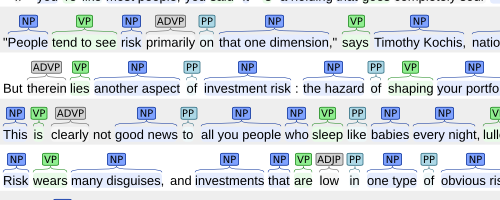

# ltext — annotation offset auto-calculation



>  picture borrowed from https://brat.nlplab.org

## Inspiration

In NLP tasks, cleanning corpus and annotating texts (add labels on texts) may happen in turn. Every label on the string should stay still and be kept as it is against all kinds of text cleanning operations, like removing extra blanks, upper case some certain substring, etc.

This lib encapsulates offset calculation of labels, in a class `LabeledText`. It aims to act like a string (supporting common methods of `str`), while keeps the excat location of every label, and protects them from being modified.

Here's two common senarios that you may need ltext:

+ corpus with annotation need a cleanning before model tranning
+ annotate on normalized text and then you want to see labels before normalization

You play with your corpus at will, with labels well protected.

## Example

```python
>>> lt = LabeledText('world--wide-web')
>>> lt
LabeledText.literal('world--wide-web')
>>>
>>> # cleanning
...
>>> lt = lt.replace('-', ' ')
>>> lt
LabeledText.literal('world  wide web')
>>> lt = lt.re_replace(r' +', ' ')
>>> lt
LabeledText('world wide web')
>>>
>>> # annotate
...
>>> lt = lt.add_label([(0, 1), (6, 7), (11, 12)])
>>> lt
LabeledText.literal('[w]orld [w]ide [w]eb')
>>>
>>> # restore
...
>>> lt = lt.restore(till_end=True)
LabeledText.literal('[w]orld--[w]ide-[w]eb')

```

