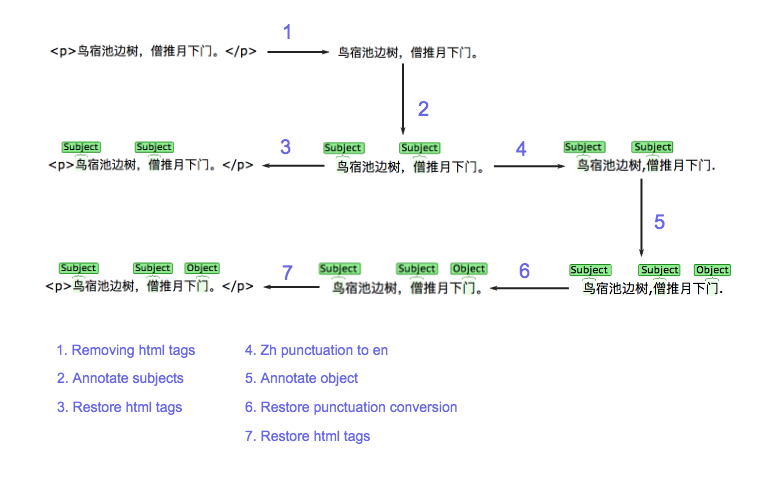

# ltext — 标注偏移量自动计算工具


>  图片源自 https://brat.nlplab.org

## 初衷

在自然语言处理（NLP）中，语料的预处理和标注（加标签）会穿插进行。预处理涉及多种文本操作，比如替换空白符、大小写转换等。与此同时，所有的标注都应标在原处，不能因文本操作而被移动、破坏。

`LabeledText` 类，封装了标注偏移量的自动计算逻辑。其目标是，在保证标签位置不动、内容不变的情况下，模仿字符串接口（即实现常用的 `str` 类方法）。

ltext 会在以下两个场景有用：

+ 带标注的语料在训练之前仍需做一些清洗
+ 标注加在被清洗过的语料上，但想看这些标注在清洗之前如何展现

用 ltext，处理语料相对自由，不需考虑标注被破坏。

## 示例



```python
>>> lt0 = LabeledText('<p>鸟宿池边树，僧推月下门。</p>')
>>>
>>> # 1. 去掉 html 标签
>>> lt1 = lt0.re_replace(r'<\/?p>', '')
>>> lt1
LabeledText.literal('鸟宿池边树，僧推月下门。')
>>>
>>> # 2. 标注主语
>>> #   加上不分类型的标签
>>> #   中括号当中的为标注片段
>>> lt2 = lt1.add_label([(0, 1), (6, 7)])
>>> lt2
LabeledText.literal('[鸟]宿池边树，[僧]推月下门。')
>>>
>>> # 3. 还原刚才去掉的 html 标签
>>> lt3 = lt2.restore()
>>> lt3
LabeledText.literal('<p>[鸟]宿池边树，[僧]推月下门。</p>')
>>>
>>> # 4. 中英文标点转换
>>> lt4 = lt2.replace('，', ',').replace('。', '.')
>>> lt4
LabeledText.literal('[鸟]宿池边树,[僧]推月下门.')
>>>
>>> # 5. 标注宾语
>>> lt5 = lt4.add_label([(11, 12)])
>>> lt5
LabeledText.literal('[鸟]宿池边树,[僧]推月下[门].')
>>>
>>> # 6. 还原中英文标点转换
>>> lt6 = lt5.restore().restore()
>>> lt6
LabeledText.literal('[鸟]宿池边树，[僧]推月下[门]。')
>>>
>>> # 7. 还原 html 标签
>>> lt7 = lt6.restore()
>>> lt7
LabeledText.literal('<p>[鸟]宿池边树，[僧]推月下[门]。</p>')
>>>
```

## 安装

项目尚未发布到 pypi，请克隆 git 仓库，用 pip -e 安装

```shell
git clone https://github.com/workingenius/ltext.git
cd ltext
# 激活 python 虚拟环境
pip install -e ./
```

